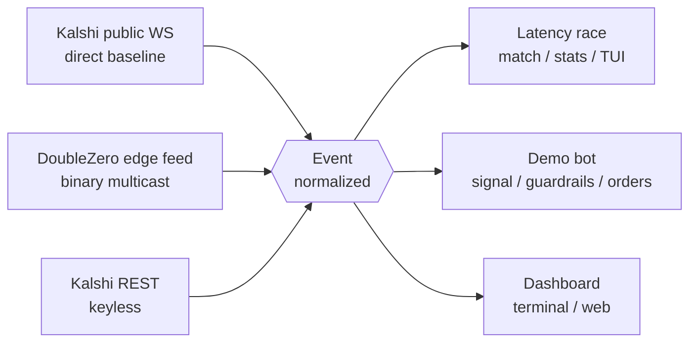

# ⚡ Edge Latency Lab

**Benchmark and consume the DoubleZero Kalshi edge feed.** A single-clock latency
benchmark against the public Kalshi WebSocket, a forkable demo bot, and an open
binary decoder for the feed — real numbers, reproducible from source, open code.


> **⚗️ Experiment, not a product.** This is an exploratory personal experiment to
> measure and visualize how much sooner a private edge feed delivers market data
> than the public path. Expect rough edges. No profit is claimed anywhere, and the
> demo bot's signal is a deliberately naïve example.

> **Independent project.** This is a personal, independent project. It is not
> affiliated with, endorsed by, or an official product of DoubleZero or
> Kalshi. Those names refer only to the systems being measured.

> **What / why.** DoubleZero delivers Kalshi market data over a private edge
> network. This lab measures — in milliseconds, with open code — how much sooner
> that feed reaches you than connecting to Kalshi directly, and gives you the
> tools to consume it. Same market, two pipes, one host, honest numbers.

---

## Three results

| # | Result | What it is |
|---|--------|------------|
| **01** | **Latency benchmark** | Captures the same Kalshi trades two ways on one host — public Kalshi WS vs. the DoubleZero edge feed — matches each trade by id, and reports `t_dz − t_public` (p10/50/90/99). One monotonic clock; no cross-machine timestamps. → [`scripts/run_race.py`](scripts/run_race.py) |
| **02** | **Reference demo bot** | A minimal, forkable bot on Kalshi's **demo** env: real trades + reference price → signal → hard guardrails → order → append-only decision log. Swap one file (`bot/signal.py`) for your strategy. → [`bot/`](bot/) |
| **03** | **Open feed decoder** | Join the multicast group, decode the fixed-size binary frames, get normalized `Event`s. Verified byte-for-byte against [`edge-feed-spec`](https://github.com/malbeclabs/edge-feed-spec). The public Kalshi WS decodes to the *same* type. → [`sources/`](sources/) |

Everything normalizes to one [`common/event.py`](common/event.py) `Event`, so sources are swappable.

---

## Quickstart (laptop — no keys, no feed)

```bash
uv sync
uv run pytest -q
uv run python -m scripts.run_race --selfcheck   # validates the matcher/stats offline (+3.000 ms recovered)
uv run python -m scripts.live                    # live Kalshi + Binance + the bot's signals, in your terminal
```

`scripts/live` is the demo bot's brain, visible: it pulls real Kalshi BTC
markets (keyless public REST) + Binance spot and prints the live signal board.

---

## How it works



Each **source** is an isolated adapter (capture → decode → `Event`). Downstream
never knows which source produced an event, so the DoubleZero feed drops in with
zero changes once it's connected.

---

## The DoubleZero Kalshi edge feed

The feed is GRE-encapsulated UDP multicast delivered over DoubleZero and
terminated on the `doublezero1` tunnel; the kernel de-encapsulates GRE so the
app reads plain UDP. Wire format: the open
[**Top-of-Book & Trades v3**](https://github.com/malbeclabs/edge-feed-spec/blob/main/top-of-book/spec.md)
binary protocol (fixed-size, little-endian) — which natively supports prediction
markets. `sources/dz_feed/` decodes it and a multicast receiver captures it.

Kalshi perps feed groups on DoubleZero mainnet-beta:
`edge-kalshi-perps-tob` (Top-of-Book & Trades) and `edge-kalshi-perps-mbp`
(Market-by-Price). Group + ports are per-deployment — discover on the host with
`doublezero multicast group list`.

---

## Live web dashboard

A monochrome, theme-aware dashboard ([`web/server.py`](web/server.py), FastAPI + SSE)
that serves real Kalshi + Binance + bot signals live, and surfaces the latency
race once the feed is connected.

```bash
uv run python -m web.server        # http://localhost:8080
```

To publish it for free without a domain, run it on a normal-IP host (a VPS / the
DZ server — **not** free serverless, which Kalshi/Binance rate-limit) and expose
it with a Cloudflare Tunnel. See [`deploy/README.md`](deploy/README.md) §7.

---

## Repo layout

```
common/                  Event, clock, storage, config, reconnecting WS client
sources/
  kalshi_ws/             Public Kalshi WebSocket adapter (capture + decode)
  kalshi_rest/           Public Kalshi REST adapter (keyless poller + decode)
  dz_feed/               DoubleZero edge feed: multicast receiver + binary decoder
race/                    Trade matcher, latency stats, PNG report, split-screen TUI
bot/                     Reference demo bot: signal, guardrails, order manager, log
dash/  web/              Terminal dashboard + live web dashboard (FastAPI/SSE)
scripts/                 run_race, live, race_demo, discover_markets, check_auth …
deploy/                  Server setup, run scripts, systemd units, tunnel guide
docs/                    Methodology, runbook, feed notes
```

---

## Reproducibility & method

Every published latency figure is reproducible from this repo. The method —
single host, one monotonic clock (`CLOCK_MONOTONIC_RAW`), per-trade-id matching,
the exact metric, threats to validity, and how the tooling is validated offline
— is written up in **[`docs/methodology.md`](docs/methodology.md)**. Written to
hold up to hostile review.

Run the real benchmark on a DoubleZero-connected host: see
[`docs/runbook.md`](docs/runbook.md) and [`deploy/README.md`](deploy/README.md).

---

## Safety

Order-placing code targets the Kalshi **demo** environment only (the base host is
asserted at construction). Never commit `.env`, `secrets/`, or `data/` — all are
gitignored.

## License

[Apache-2.0](LICENSE).
